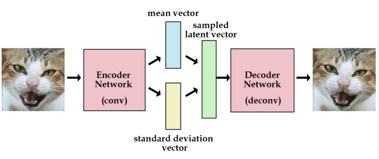
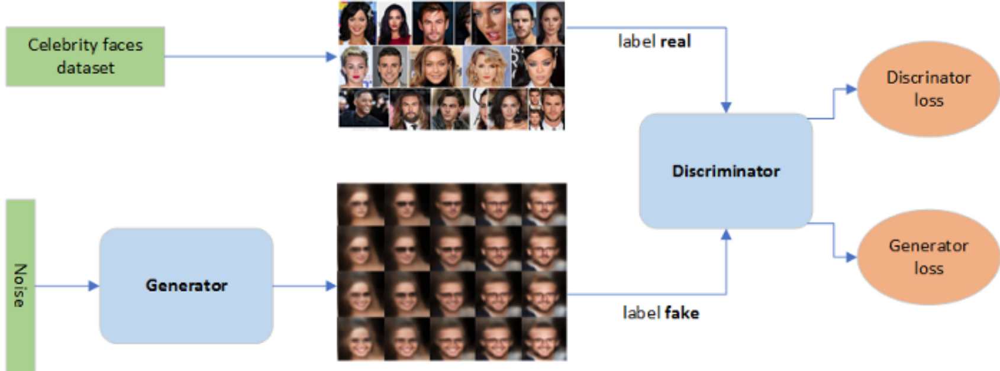
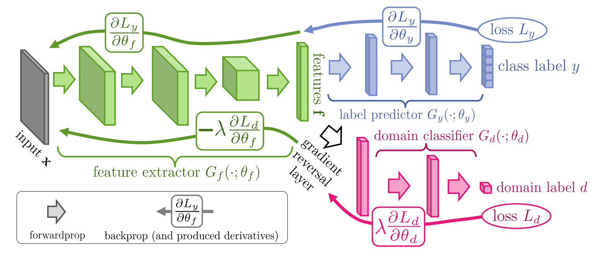
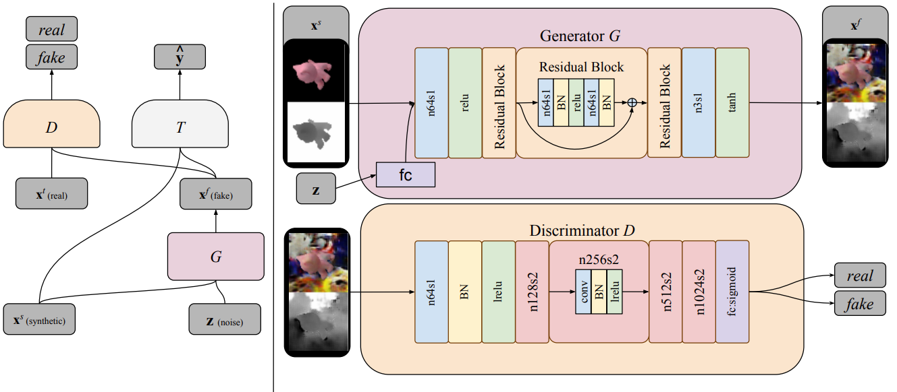

# Deep Learning for Computer Vision HW3
## Introduction
In HW3, we will use CelebA datasets of human face and digit images to implement the models of both VAE and GAN for generating human face images, and the model of DANN for classifying digit images from different domains.

  

Datasets Citation:
@inproceedings{liu2015faceattributes,
  title = {Deep Learning Face Attributes in the Wild},
  author = {Liu, Ziwei and Luo, Ping and Wang, Xiaogang and Tang, Xiaoou},
  booktitle = {Proceedings of International Conference on Computer Vision (ICCV)},
  month = {December},
  year = {2015} 
}

## HW3 Project 1 ― VAE
A variational autoencoder (VAE) is a type of neural network that learns to reproduce its input, and also map data to latent space. it is worth noting that a VAE model can generate samples by sampling from the latent space.

In this project, done list:
- Implement a VAE model and train it on a face dataset. 
- Compare the original images and reconstructed images from VAE model.(calculate KL divergence and mean square error) 
- Randomly generate 32 images by sampling latent vectors from an normal distribution.
- Visualize the latent space by mapping the latent vectors of the test images to 2D space (by tSNE) and color 
them with respect to an attribute (e.g., gender and hair color). 

## HW3 Project 2 ― GAN
A generative adversarial network (GAN) is a deep learning method in which two neural networks (generator and discriminator) compete with each other to become 
more accurate in their predictions.

In this project, done list:
- Build and train a Generator and a Discriminator in GAN model.
- Samples 32 noise vectors from normal distribution and input them into a Generator to generate 32 images.

## HW3 Project 3 ― DANN
In this project, done list:
- Implement DANN on digits datasets (USPS, MNIST-M and SVHN) and consider the following 3 scenarios: 
	
	(Source domain → Target domain)
	
	1. USPS → MNIST-M

	2. MNIST-M → SVHN

	3. SVHN → USPS
- Compute the accuracy on target domain, while the model is trained on source domain only. (lower bound)
- Compute the accuracy on target domain, while the model is trained on source and target domain. (domain adaptation)
- Compute the accuracy on target domain, while the model is trained on target domain only. (upper bound)
- Visualize the latent space by mapping the testing images to 2D space (with t-SNE) and use different colors to indicate data of (a) different digit classes 
0-9 and (b) different domains.

## HW3 Project 4 ― Improved UDA model
Implement improved model on digits datasets(USPS, MNIST-M and SVHN) for unsupervised domain adaptation.

## Dataset
### A subset of human face dataset: 

- size = 64 * 64 * 3

- 40000 training images

- 13 out for 40 attributes.

### Digits datasets:

USPS: 
- 7291/2007 (training set/testing)
- classes = 0~9
- size = 28 * 28 * 1

MNIST-M:
- 60000/10000 (training set/testing)
- classes = 0~9
- size = 28 * 28 * 3

SVHN:
- 73257/26032 (training set/testing)
- classes = 0~9
- size = 28 * 28 * 3

Contact me for Dataset or [CelebA](https://mmlab.ie.cuhk.edu.hk/projects/CelebA.html]). 

Email: chengliang.yeh@gmail.com

## Models
- VAE(variational autoencoder)

- GAN(generative adversarial network)

Reference:

[GAN for dummies](https://towardsdatascience.com/generative-adversarial-network-gan-for-dummies-a-step-by-step-tutorial-fdefff170391) 

- DANN(Domain-Adversarial Training of Neural Networks)

Reference:

[EYD與機器學習](https://zhuanlan.zhihu.com/p/51499968), [Domain-Adversarial Training of Neural Networks](https://arxiv.org/abs/1505.07818)

- PixelDA

Reference:

[Unsupervised Pixel-Level Domain Adaptation with Generative Adversarial Networks](https://arxiv.org/abs/1612.05424)

## Evaluation
To evaluate your UDA models, run the evaluation script by using the following command.

    python3 hw3_eval.py $1 $2

 - `$1` is the path to your predicted results (e.g. `hw3_data/digits/mnistm/test_pred.csv`)
 - `$2` is the path to the ground truth (e.g. `hw3_data/digits/mnistm/test.csv`)

Note that for `hw3_eval.py` to work, your predicted `.csv` files should have the same format as the ground truth files we provided in the dataset as shown below.

| image_name | label |
|:----------:|:-----:|
| 00000.png  | 4     |
| 00001.png  | 3     |
| 00002.png  | 5     |
| ...        | ...   |

## Packages
- This homework should be done using python3.6. Please refer to the requirments.txt for more details about others packages.

- You can run the following command to install all the packages listed in the requirements.txt:

	pip3 install -r requirements.txt

- Note that using packages with different versions will very likely lead to compatibility issues, so make sure that you install the correct version if one is specified above.

## Others
 1.   `hw3_p1.sh`  
The shell script file for running your VAE model.
 2.   `hw3_p2.sh`  
The shell script file for running your GAN model.
 3.   `hw3_p3.sh`  
The shell script file for running your DANN model.
 4.   `hw3_p4.sh`  
The shell script file for running your improved UDA model.
 5.   Run code in the following manner:

    bash ./hw3_p1.sh $1
    bash ./hw3_p2.sh $1
    bash ./hw3_p3.sh $2 $3 $4
    bash ./hw3_p4.sh $2 $3 $4

-   `$1` is the path to your output generated images (e.g. hw3/VAE/fig1_4.png or hw3/GAN/fig2_2.png ).
-   `$2` is the directory of testing images in the **target** domain (e.g. `hw3_data/digits/mnistm/test`).
-   `$3` is a string that indicates the name of the target domain, which will be either `mnistm`, `usps` or `svhn`. 
	- Note that you should run the model whose *target* domain corresponds with `$3`. For example, when `$3` is `mnistm`, you should make your prediction using your "USPS→MNIST-M" model, **NOT** your "MNIST-M→SVHN" model.
-   `$4` is the path to your output prediction file (e.g. `hw3_data/digits/mnistm/test_pred.csv`).

6.   Trained Models weights will be auto downloaded by shell script file commands. If the dropbox link dead, please contact me.

### Remarks
- If your model is larger than GitHub’s maximum capacity (100MB), you can upload your model to another cloud service (e.g. Dropbox). However, your shell script files should be able to download the model automatically. For a tutorial on how to do this using Dropbox, please click [this link](https://goo.gl/XvCaLR).
- **DO NOT** hard code any path in your file or script, and the execution time of your testing code should not exceed an allowed maximum of **10 minutes**.
- **Please refer to HW3 slides for details about the penalty that may incur if we fail to run your code or reproduce your results.**

# Q&A
If you have any problems related to HW3, you may
- Use TA hours
- Contact TAs by e-mail ([ntudlcv@gmail.com](mailto:ntudlcv@gmail.com))
- Post your question under hw3 FAQ section in FB group
